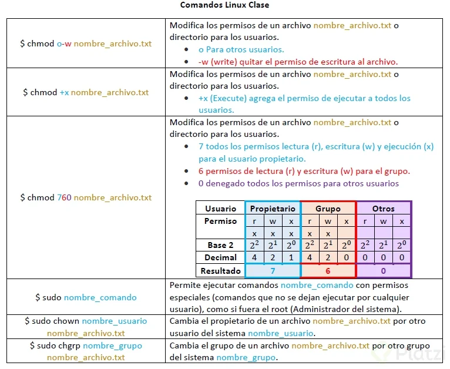

# Terminal y línea de comandos

Referencias rápidas de la terminal y línea de comandos en el sistema operativo GNU/Linux.

## Tabla de contenido
- [Que es la terminal](#Que-es-la-terminal).
   - [Ventajas](#Ventajas).
- [Los comandos](#Los-comandos).
   - [Interacción con archivos y carpetas](#interaccion-con-archivos-y-carpetas).
   - [Wildcards](#wildcards).
   - [Instalaciones](#instalaciones).
   - [Herramientas de compresion y combinación de archivos](#Herramientas-de-compresion-y-combinación-de-archivos).
   - [Herramientas para interactuar a través de HTTP](#Herramientas-para-interactuar-a-través-de-HTTP).
   - [Acceso seguro a otras computadoras](#Acceso-seguro-a-otras-computadoras).
   - [Utilitaria](#utilitaria).
- [Directorios](#directorios).
- [Comunicación entre procesos](#Comunicación-entre-procesos).
- [Administración de procesos en background y foreground](#Administración-de-procesos-en-background-y-foreground).
   - [Ver todos los procesos en background](#Ver-todos-los-procesos-en-background).
   - [Como detener un proceso](#Como-detener-un-proceso).
- [El sistema de permisos octal](#El-sistema-de-permisos-octal).
- [Sistemas de manejo de paquetes](#Sistemas-de-manejo-de-paquetes).
- [Variables de entorno](#Variables-de-entorno).


## Que es la terminal
La terminal es un programa que recibe instrucciones o comandos y las ejecuta. Básicamente es el intérprete entre el usuario y la máquina, el cual se comunican por medio de comandos en texto plano, sin interfaz gráfica.

### Ventajas
- Su alta eficiencia.
- Automatización de tareas repetitivas.

## Los comandos
Están맊ompuestos맗or:
- Nombre맋e맛n맗rograma.
- Parámetros.
- Modificadores.

### Interaccion con archivos y carpetas
| Comando | Descripción |
| ----- | ---- |
| whereis [nombreDeLaApp] | Muestra la ruta de una app especifica. |
| which [nombreDeLaApp] | Muestra la ruta de una app especifica. |
| shutdown -hr | Configurar el apagado del sistema, con opción de dar un aviso a los demás en la red local. |
| pwd | Print Working Directory: se usa para mostrar el directorio actual en el que nos encontramos trabajando. |
| cd [ruta] | Cambiar de directorio a la ruta especificada. |
| cd .. | Cambiar al directorio padre de la ubicación actual. |
| cd / | Cambia al directorio raíz. |
| pushd | Cambia a la ruta de directorio especificada. Con el comando `popd`, vuelve a la ubicación de directorio en la que estaba. |
| ls | Lista todas las carpetas de la ruta actual. |
| ls -a | Lista todas las carpetas de la ruta actual y también las que están ocultas. |
| ls -t | Ordena los archivos por fecha de modificación. |
| ls -x | Ordena elementos primero por nombre y después por extensión. |
| ls -X | Ordena los elementos primero por extensión y luego por nombre. |
| ls -l | Muestra toda la información: usuario, grupo, permisos, tamaño, fecha y hora de creación. |
| ls -lh | Muestra la misma información que ls -l pero con las unidades de tamaño en KB, MB. |
| ls -R | Muestra el contenido de todos los subdirectorios de forma recursiva. |
| ls -S | Ordena los resultados por tamaño de archivo. |
| tree | Muestra las carpetas del sistema en arbol. |
| locate [nombreBusqueda] | Buscar un archivo, caperta, etc... que contenga la cadena argumentada. Si no genera resultados, pruebe primer con `sudo updatedb` y realice de nuevo la búsqueda. |
| cp [valor_a_copiar] [ruta_destino] | Copiar y pegar en una ruta o en un archivo nuevo. |
| find [punto_origen_a_buscar] [opciones] [términos_busqueda] | Buscar un archivo en un lugar especifico o por tamaño, nombre, byte, etc... Ejemplo: `$ find . -user victor -perm 644`. Lo anterior, encuentra todo archivo o carpeta donde el propietario es victor y tenga permiso para leer y escribir. También se puede hacer un proceso seguido de los resultados, ejemplo: `$ find . -type f -mtime +7 -exec cp {} ./backup/ \;`. El `-exec` indica la ejecución de otro proceso seguido de la búsqueda. Los `{}` indica que esos caracteres serán reemplazados por cada resultado encontrado. El `\` indica la finalización del proceso. |
| cat [nombre_archivo]  | Ver un archivo no tan pesado (que no proporcione desplazamiento). |
| more [nombre_archivo] | Permite visualizar el contenido de un archivo por paginación. |
| tac | Para ver un archivo desde la última linea en adelante (backwards). |
| less [nombre_archivo] | Para ver el contenido de un archivo pesado. Proporciona scroll-back y opciones de búsqueda. Se debe presionar `q` para salir de la lectura. |
| tail [nombre_archivo] | Muestra las últimas 10 lineas del archivo. Para cambiar la cantidad de lineas a mostrar, se coloca `-n` donde n es la cantidad de lineas a mostrar. |
| head [nombre_archivo] | Muestras las primeras tres lineas del archivo. También se puede usar `-n` para definir la cantidad  de lineas a mostrar. |
| touch [nombre_archivo] | Crea un archivo. |
| mkdir [nombre_carpeta] | Crea una carpeta. |
| rmdir [nombre_carpeta] | Borra una carpeta (solo si está vacía). |
| mv [nombre_archivo_actual] [nombre_archivo_nuevo] | Renombra un archivo. |
| rm [nombre_archivo] | Eliminar un archivo. |
| rm -f [nombre_archivo] | Forzar eliminación de un archivo. |
| rm -i [nombre_archivo] | Eliminar archivo pero primero solicita confirmación del usuario. |
| rm -rf [nombre_archivo_o_dir] | Fozar la eliminación del directorio y todo su contenido del arbol de archivos y carpetas que tenga dentro. |
| diff [nombre_archivo_o_dir_1] [nombre_archivo_o_dir_2] | Compara archivos o carpetas |
| diff -c [nombre_archivo_o_dir_1] [nombre_archivo_o_dir_2] | Proporciona una lista de las diferencias que se compone de 3 líneas de contexto antes y después de las líneas que difieren en contenido. |
| diff -r | Se utiliza para comparar recursivamente los subdirectorios, así como el directorio actual. |
| diff -i | Ignorar el caso de las letras. |
| diff -w | Ignorar la diferencia de espacios y tab.
| diff3 [MY-FILE] [COMMON-FILE] [YOUR-FILE] | Compara tres archivos al mismo tiempo. |
| grep [expresion_regular] [nombre_archivo] | Filtra las líneas que queremos visualizar utilizando (o no) expresiones regulares. Para omitir mayúsculas y minísculas, usar el modificador -i |
| sed 's/[cadena_a_sustituir]/[cadena_que_reemplaza]/' [nombre_archivo] | Modifica partes del contenido de salida sin modificar el archivo original. Se puede separar varios cambios en el flujo con el punto y coma, por ejemplo: `$ sed 's/NOMBRE_USUARIO/Ana/; s/PUNTOS_USUARIO/35/' archivo-saludo.txt` |

### Wildcards
| Wildcard | Descripción |
| ----- | ---- |
| ? | Coincidir con cualquier caracter individual de la búsqueda. |
| * | Coincidir con cualquier cadena de caracteres de la búsqueda. |
| [set] | Coincidir con cualquier caracter en un conjunto de caracteres. Por ejemplo, [adf] podría coincidir cualquier ocurrencia con "a", "d" o "f" |
| [!set] | Coincidir con cualquier caracter que no esté en el conjunto de caracteres especificados |


### Instalaciones
| Comando | Descripción |
| ----- | ---- |
| sudo apt-cache search [Nombre_Paquete] | Busca el paquete de instalación y muestra una información preliminar del paquete. |
| sudo apt-get install [Nombre_Paquete] | Instala el paquete. |
| sudo apt-cache policy [Nombre_Paquete] | Imprime el estatus del paquete. |
| sudo apt-get remove [Nombre_Paquete] | Elimina el paquete. |
| sudo dpkg -L | Lista todos los paquetes instalados. |
| sudo apt-get update | Prepara los paquetes que tengan actualización disponible. Verifica dependencias entre paquetes. |
| sudo apt-get upgrade | Actualiza los paquetes que tengan actualizaciones disponibles. Se requiere ejecutar previamente el comando anterior. |

### Herramientas de compresion y combinación de archivos
| Comando | Descripción |
| ----- | ---- |
| gzip [nombre_archivo] | Para comprimir un archivo. |
| gzip -d [nombre_archivo].tx.gz | Para descomprimir el archivo. |
| tar cf [nombre_paquete_a_crear].tar [ruta_archivos_a_empaquetar] | Para empaquetar archivos. Lo anterior, no comprime los archivos. |
| tar xf [nombre_paquete].tar | Para desempaquetar. |
| tar -cvf [nombre_paquete_a_crear].tar [ruta_dir_a_empaquetar] | Para empaquetar y ver contenido empaquetado. |

### Herramientas para interactuar a través de HTTP
| Comando | Descripción |
| ----- | ---- |
| curl [url] | Se utiliza para hacer pedidos "crudos" a un servidor HTTP. Muestra la respuesta del servidor en la consola. |
| curl -v [url] | Se utiliza para hacer pedidos "crudos" a un servidor HTTP. Adicionalmente, devuelve toda la comunicación HTTP. |
| curl -v [url] > /dev/null | Se utiliza para hacer pedidos "crudos" a un servidor HTTP. Solo devuelve los encabezados HTTP. |
| wget [url] | Se utiliza para hacer descargar desde servidores HTTP de archivos binarios. |

### Acceso seguro a otras computadoras
Los siguientes comandos, nos permite realizar conexiones seguras a otros dispositivos:
| Comando | Descripción |
| ----- | ---- |
| ssh [user] [host] | Realiza una conexión segura con el host. Los comandos que se ejecuten de ahí en adelante, será en el host. El directorio oculto /~/.ssh/config contiene la configuración de las conexiones creadas. |
| mail -s [asunto] [dir_correo] | Enviar un email desde un servidor. |

### Utilitaria
| Comando | Descripción |
| ----- | ---- |
| command1 <html>&#124;</html> command2 <html>&#124;</html> command3 | Pipeline o tuberias. Toma un proceso para pasarlo a otro proceso como entrada. Los procesos se separan por el simbolo pipeline. Ejemplo: cat dump1.sql <html>&#124;</html> wc -l. Lo anterior, indica cuantas líneas tiene el archivo dump1.sql |
| clear | Borra el historial de impresiones que tenga la consola. |
| df -Th | Muestra una estadísticas del uso de los archivos de sistema y su capacidad de espacio en disco. |
| ps | Produce una lista de los procesos junto con la información de estado del sistema. |
| nano | Editor de texto por defecto. |
| history | Histórico de todos los comandos que hemos hecho. Si escribimos por ejemplo `$ !248`, la terminal ejecutará el comando que estaba asociado al id 248 del histórico. |

## Directorios
La definición de directorios en Linux:
| Nombre directorio | Uso |
| ----- | ---- |
| . | Hace referencia al directorio actual. |
| .. | Hace referencia al directorio padre. |
| ~ | Ubicación del directorio del usuario, ejemplo: /home/tu_usuario |
| / | La raiz del arbol de directorios del sistema. |
| /bin /sbin | Contiene los binarios ejecutables, comandos esenciales que se utilizan en el modo de un solo usuario y comandos esenciales requeridos por todos los usuarios del sistema. el sbin se utiliza para binarios esenciales relacionados con la administración del sistema, tales como ifconfig y shutdown. |
| /dev | Contiene nodos de dispositivos, un tipo de pseudo-archivo utilizado por la mayoría de los dispositivos de hardware y software, a excepción de los dispositivos de red. |
| /var | Contiene archivos que se espera que cambien de tamaño y contenido cuando el sistema está en funcionamiento (var significa variable). |
| /etc | Es el home de los archivos de configuración del sistema. No contiene programas binarios, aunque hay algunas secuencias de comandos ejecutables |
| /boot | Contiene los pocos archivos esenciales necesarios para arrancar el sistema. |
| /lib | Contiene las librerias (código común compartida por las aplicaciones) para los programas esenciales en / bin y / sbin |
| /media | Normalmente donde se encuentra en donde se montan los medios extraíbles, como CD, DVD y unidades USB. |
| /opt | Paquetes de aplicaciones de software opcionales. |
| /sys | Pseudo sistema de archivos virtual con información sobre el sistema y el hardware. Puede ser utilizado para modificar los parámetros del sistema y para fines de depuración. |
| /srv | Datos específicos del sitio servido por el sistema. rara vez se utiliza. |
| /usr | Multiusuario aplicaciones, servicios y datos. |
| /usr/include | Archivos de cabecera utilizados para compilar aplicaciones. |
| /usr/lib | Las librerias de programas en / usr/bin y /usr/sbin. |
| /usr/lib64 | Librerias de 64 bits para programas de 64 bits en /usr/bin y /usr/sbin. |
| /usr/sbin | Binarios del sistema no esenciales, tales como los demonios del sistema. |
| /usr/share | Los datos compartidos utilizados por las aplicaciones, generalmente independiente de la arquitectura. |
| /usr/src | El código fuente, por lo general para el núcleo de Linux. |
| /usr/X11R6 | Archivos de configuración de X Window. Generalmente obsoleto. |
| /usr/local | Los datos y programas específicos para la máquina local. Subdirectorios incluyen bin, sbin, lib, compartir incluir, etc. |
| /usr/bin | Este es el directorio principal de comandos ejecutables en el sistema. |

## Comunicación entre procesos
Los canales por donde ingresan los datos a un proceso y se muestra un resultado, se le conoce como flujos. En la terminal, se tiene al menos los siguientes tres flujos:

- Entrada.
- Salida.
- Error.

Por defecto, estos canales están conectados a los siguientes periféricos:

- El teclado, con el flujo de entrada.
- La pantalla, con el flujo de error y salida.

Podemos redireccionar la entrada para que no sea por medio del teclado, sino por medio de un archivo, usando el símbolo `<`. En el siguiente ejemplo, se conecta a la base de datos MySQL y luego ejecuta el script dump1.sql:

`$ mysql -h 127.0.0.1 -u root -p1234 < dump1.sql`

La segunda forma de redirección, es la de salida, para que no se muestre los resultados en pantalla, sino guardar en un archivo. Lo anterior, se puede hacer con el símbolo `>`, por ejemplo:

`$ ls > archivo.txt`

Con el doble mayor `>>`, redirecciona la salida del flujo y coloca el resultado en la parte final de un archivo existente:

`$ ls -a >> archivo.txt`

## Administración de procesos en background y foreground
Para ejecutar un proceso y dejarlo en background, solo basta con poner `&` al final de la sentencia de comando, por ejemplo:

`$ mysql -h 127.0.0.1 -u root -p1234 < dump1.sql &`

La terminal ejecutará el proceso anterior, pero no dejará esperando al usuario hasta que termine dicho proceso.

También, podríamos ejecutar la sentencia anterior sin el `&`, tan solo presionando `Control + z` para dejar el proceso en background. Si queremos pasar el proceso background nuevamente a primer plano o foreground, ejecutamos el comando `$ fg`.

### Ver todos los procesos en background
Los comandos más comunes son:

| Comando | Descripción |
| ----- | ---- |
| ps | Lista los estados de un procesos. |
| ps ax | a: Muestra todos los procesos de la terminal actual incluyendo los de otros usuarios. x: Muestra los procesos en un estilo BSD (sin controlar la [TTY]). |
| top | Es un programa de monitorización, administración y visor de procesos que se encuentra en muchos sistemas operativos de tipo Unix. Produce una lista ordenada de procesos en ejecución seleccionados por criterios especificados por el usuario y los actualiza periódicamente. |

### Como detener un proceso
Si está siendo ejecutado en foreground, solo basta con ejecutar Control + c.
Si está siendo ejecutado en background, tenemos dos comandos:
| Comando | Descripción |
| ----- | ---- |
| kill -9 [num_PID] | Corta inmediatamente un proceso. El identificador PID se puede obtener del comando `$ ps ax` |
| killall [nombre_archivo_ejecutable] | Puede tener dos implementaciones, ambas peligrosas para usuarios root. Podría matar todos los procesos que no responde a las señales. |

## El sistema de permisos octal
Todos los archivos Unix tienen:

- Propietario quien creó el archivo.
- Grupo de usuarios que podrían gestionar el archivo.
- Otros usuarios que podrían gestionar el archivo.

Operaciones sobre un archivo:
- Lectura (r).
- Escritura (w).
- Ejecución (x).

Cada archivo muestra tres grupos de permisos, el cual se representa en el siguiente orden: dueño del archivo, grupo de usuarios y otros usuarios, ejemplo: `-rw-rw-rw`.Lo anterior, significa que tanto el dueño, grupo de usuarios y otros usuarios, tienen permiso de lectura y escritura en un directorio o archivo y ninguno de los tres grupos tienen permiso para ejecutarlo (x).

Hay tres comandos para hacer cambios de permiso en archivos y directorio Linux:
- chmod.
- chown.
- chgrp.

El siguiente cuadro fue un aporte de un [estudiante](https://platzi.com/@yarag/) de Platzi:



## Sistemas de manejo de paquetes
Existen programas que se encargan de administrar los paquetes de software los cuales podrán ser instalados en nuestro sistema Linux. Dependiendo de que distribución de Linux tengamos, podremos usar alguno de los siguiente programas de administrador de paquetes binarios:
- apt.
- zypper.
- rpm.

Ejemplo: Instalar el programa de comando `lynx`, el cual sirve para tener un navegador web en la terminal, donde solo muestra el texto del sitio web consultado:

`$ sudo apt install lynx`

El comando anterior, se encarga de verificar si requerimos alguna dependencia antes de instalar el nuevo programa.

**Paquetes de lenguajes**
Cuando se requieren instalar librerías (no son paquetes binarios). Alguno de los programas que se encargan de toda la administración de paquetes de lenguajes, son:
- pip: Para gestionar librerias en python.
- composer: Para gestionar librerias en php.
- npm: Para librerias de node.js.

**Paquetes genéricos**
Los siguientes programas administran tanto paquetes binarios como paquetes de lenguajes:
- Conda.
- homebrew.

## Variables de entorno
Es una definición global en el sistema, el cual todos los procesos tienen acceso, por ejemplo: Cuando usamos el programa `$ curl`, estamos usando implícitamente el valor de la variable de entorno `$PATH`,el cual tiene almacenado las rutas de los programas binarios. Por esa razón, no es necesario escribir toda la ruta del programa curl al usarlo en la terminal.

Definir una variable de entorno local y asignar un valor. Puede ser un comando a ejectuar, ejemplo:

`$ VAR=[comando_ejecutar]`

La variable local es visible solo en el shell donde definió.

Definir una variable de entorno global y asignar un valor para toda la sesión:

`$ export VAR=valor`

La variable global es visible para cualquier proceso en ejecución o que se ejecute desde el shell.

## Shell Scripts
Utilizado para automatizar tareas repetitivas. Básicamente, se ejecutará los mismos comandos que se usan en la terminal, pero ahora pensado para hacerlo repetida veces, pero también, para combinar una cantidad larga de secuencia de comandos en uno simple.

Sintaxis:

```shell
#!/bin/bash
# code here...
```
La primera línea del script `#!/bin/bash`, contiene la ruta completa del intérprete de comandos (en este caso /bin/bash) que interpretará las sentencias escritas en el archivo.

Otros posibles interpretadores de shell:
- /bin/sh
- /bin/bash
- /bin/tcsh
- /bin/csh
- /bin/ksh

### Imprimir Hello World
Creamos el archivo `hello.sh`

`$ nano hello.sh`

Escribimos el siguiente script:

```shell

#!/bin/bash

echo "Hello World"

```
Para ejecutar el archivo hello.sh, podemos hacerlo de dos formas:

`$ ./hello.sh`

`$ bash hello.sh`

### Uso de variables temporales
Usamos el caracter `$` para denotar que una cadena escrita, es una variable temporal.

Ejemplo:

```shell

#!/bin/bash
   # Interactive reading of variables
   echo "ENTER YOUR NAME"
   read sname
   # Display of variable values
   echo $sname

```
### Visualizacion de valores de retorno
Todo script o comando ejecutado, retorna un valor temporal para saber si el proceso fue exitoso o no. Para conocer ese valor y manipular de el, se puede ver como `$ echo $?`. Retorna el valor 0, si el proceso fue exitoso, de lo contrario retorna un valor diferente a cero.

Ejemplo para un proceso exitoso:

```shell

$ ls /etc/passwd
/etc/ passwd

$ echo $?
0

```

Ejemplo para un proceso no exitoso:

```shell

$ ls /foo/foo
ls: cannot access..

$ echo $?
2

```

### Sintaxis basica y caracteres especiales

| Caracter | Descripción |
| ----- | ---- |
| # | Para realizar comentarios de una linea. |
| \ | Se utiliza al final de una línea para indicar la continuación a la siguiente línea. |
| ; | Se utiliza para interpretar lo que sigue como un nuevo comando. |
| $ | Indica que lo siguiente es una variable. |


### Exportar variables
Podemos crear y declarar una variable, para luego ser exportada y utilizada en un script.

Ejemplo:

`$ VERSION=$(unam -r); export VERSION`

Validamos que la variable fue creada y exportada:

`$ export`

En la impresión de los resultados, encontraremos la variable creada `VERSION=value` y ahora puede ser usada en un script como `$VERSION`.

### Editores de texto en la terminal

Una de las utilidades más importantes de la terminal es el editor de texto.
Hay diferentes opciones, pero **Vim** es uno de los mas sencillos y populares. También está **Emacs** y **Nano** 🤔.
- `vi <archivo>` es la versión vieja. 👴🏽
- `vim <archivo>`: Vi modern. Tenemos dos modos, el normal o de inserción, para instertar presionamos la `tecla i` y para salir presionamos `Esc`. Para salir del editor y guardar `:wq`. 🔒
- Este editor tiene un resaltador de sintaxis 😄 depende del tipo de archivo.
- Al igual que con `less` para buscar una palabra, podemos hacerlo en Vim con `/<palabra>`. Te lleva a la primera coincidencia.
- Para eliminar una línea, desde el modo normal, nos ponemos al inicio de la línea y presionamos `dd`.

### Personalizar la terminal de comandos

Podemos personalizar la terminal para que quedé bonita, profesional y sea muy cómoda 💖.

- Para esto, podemos usar un emulador llamado [Tilix](https://gnunn1.github.io/tilix-web/). En Tilix podemos tener varias terminales activas 🤯.
- Podemos instalar **ZSH**, y luego `chsh -s <> $(which zsh)`, con este comando podemos cambiar de shell.
- Ya en ZSH, podemos instalar un enhancer que incrementa las capacidades de la shell:
  - [Oh My Zsh - a delightful & open source framework for Zsh](https://ohmyz.sh/)
  - [Oh My Zsh - Github](https://github.com/ohmyzsh/ohmyzsh/wiki)

- [Customize Windows Terminal with WSL2](https://dev.to/shettykaran21/customize-windows-terminal-with-wsl2-od9)
- Para regresar a bash `exec bash` y para ir a ZSH `exec zsh`. 👀
- Puedes mejorar aún más tu terminal con PowerLevel10k 🚀:
  - [GitHub - romkatv/powerlevel10k: A Zsh theme](https://github.com/romkatv/powerlevel10k)
- Es importante que instales las fonts necesarias para usar la funcionalidad máxima de esto 🔥.

- [Personalizar la terminal por codevars](https://www.edevars.com/blog/personalizar-terminal)

